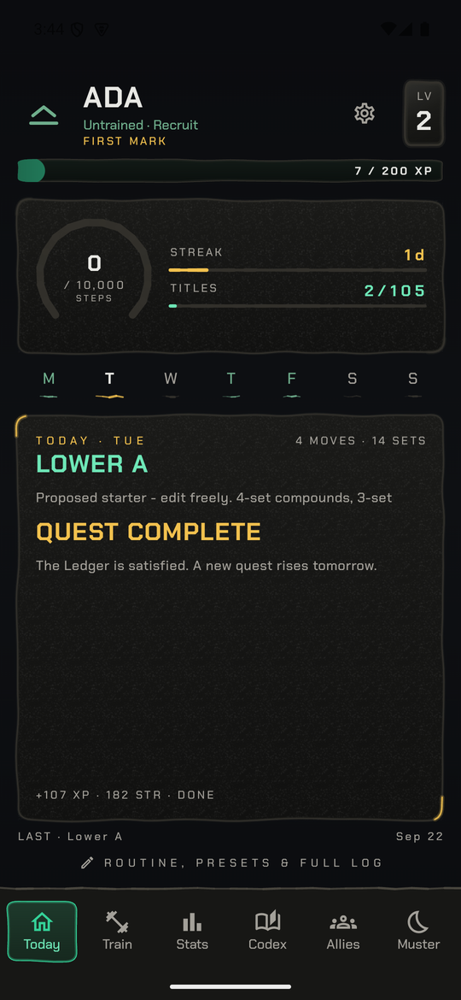
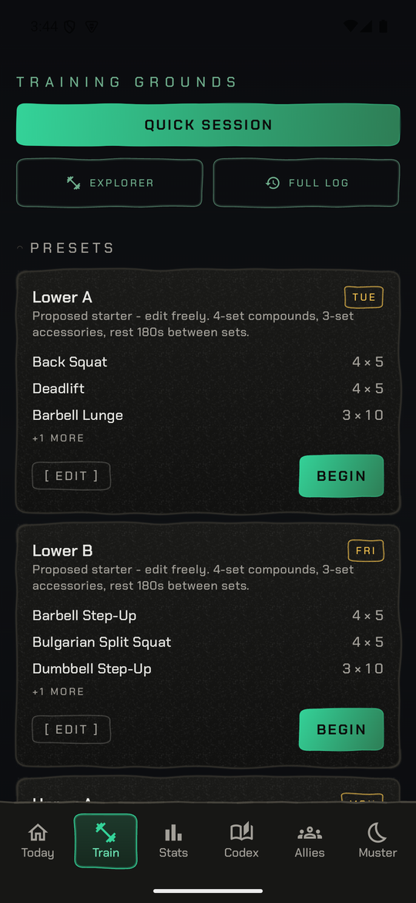
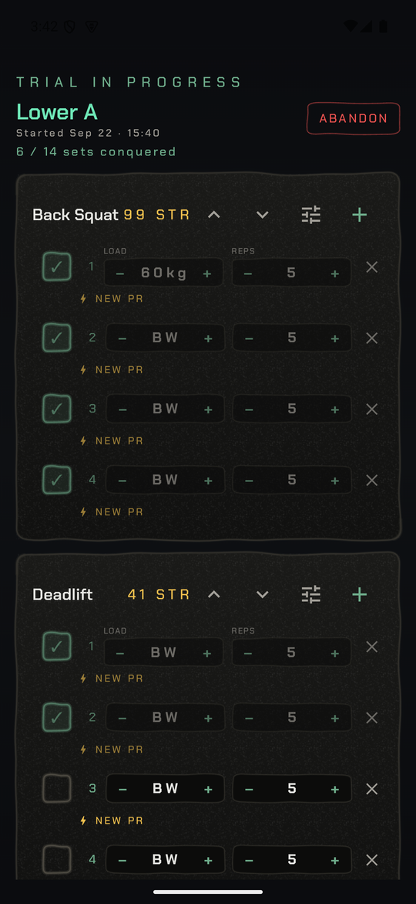
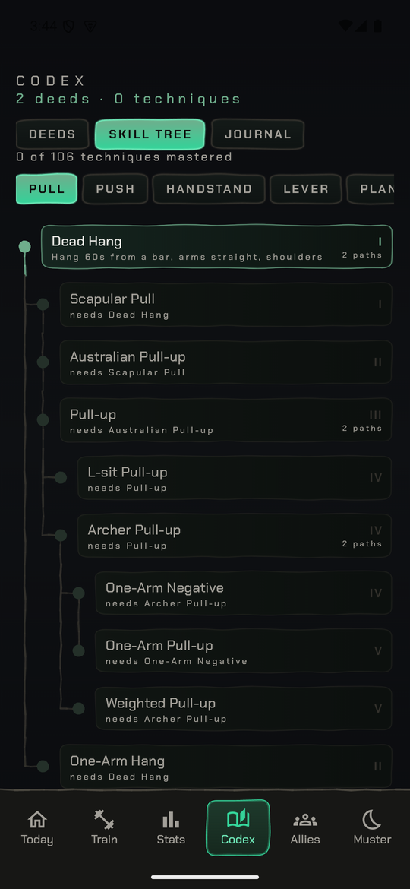
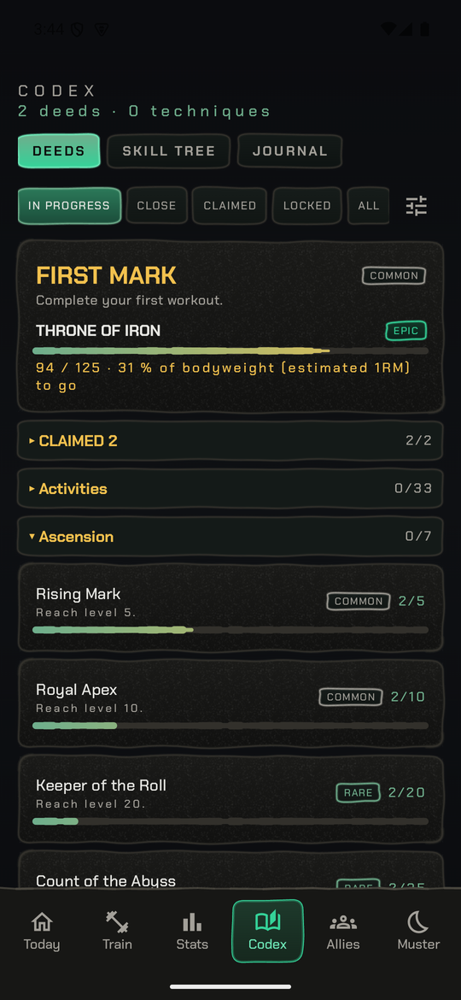
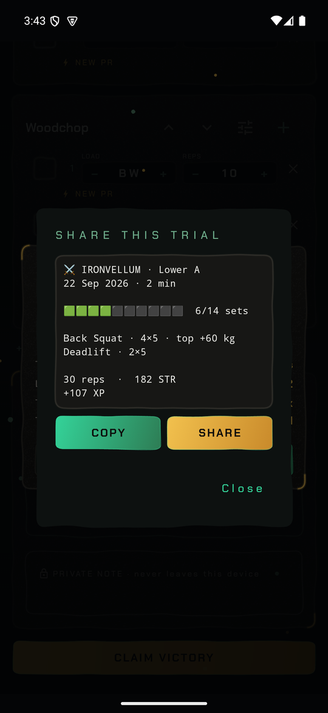
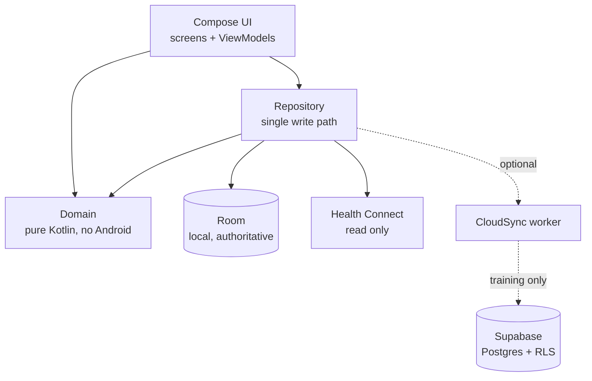

<div align="center">


# Ironvellum

**An Android training tracker that scores what you actually lift.**

Log a session, get a number that means something. Body-scaled strength scoring,
a 106-technique calisthenics tree, and a first-run flow that builds you a week.

[](https://github.com/AlexMollard/Ironvellum/actions/workflows/ci.yml)
[](https://github.com/AlexMollard/Ironvellum/actions/workflows/apk.yml)


</div>

---

<div align="center">

| Your day | The week it built you | The trial |
|:---:|:---:|:---:|
|  |  |  |

| Skill tree | Deeds | Share card |
|:---:|:---:|:---:|
|  |  |  |

</div>

## Why this exists

Most trackers add up kilograms. That rewards being heavy and rewards machines
that hide how much load you are really moving, so the number you chase drifts
away from the training that earned it.

Ironvellum scores a set by what it costs you:

- **Body-scaled.** A rep is worth `reps x (bodyweight + added) / bodyweight^0.67`,
  the standard allometric exponent, so a lighter athlete is not permanently
  outranked for being light.
- **Priced per implement.** A marked kilogram is not the same load on every
  machine. A 45 degree sled transmits `0.70`, a smith bar `0.90`, a pinned stack
  `0.85`, a dual pulley `0.50`. The plate you see is converted to the load you
  actually carry.
- **Difficulty-weighted.** A handstand push-up and a push-up are not the same
  rep. Tiers come from the skill tree the app already ships, so the ordering is
  the one the progression states.
- **Per-sex standards.** Strength score is normalised by muscle group using
  published gaps (Miller et al., sanity-checked against IPF GL), and every
  strength deed states the bar for the lifter reading it rather than the men's
  number with a footnote.

Everything works offline. An account is optional and only ever backs up
training.

## Features

|  | |
|---|---|
| **Guided first run** | Answers your days, equipment and goal, then proposes an editable week built from the real catalogue. No routine is imposed on you. |
| **214 movements** | Barbell, dumbbell, cable, plate-loaded, selectorised, smith, assisted, bodyweight, plus cardio, sport, climbing, water and mobility. |
| **106-technique skill tree** | Fourteen lines: pull, push, handstand, lever, planche, rings, movement, legs, core, mobility, plus squat, bench, press and deadlift ladders with bodyweight-relative bars. Each rung is gated on the one before it and carries a written claim standard. |
| **105 deeds** | Level, volume, streak, strength and activity milestones, with progress you can watch rather than a surprise. |
| **Progressive overload** | Strength and hypertrophy schools with their own rep bands, per-movement load steps and a stall rule that deloads instead of repeating a failed session. |
| **Measurements and health** | Weight, body fat, BMI and FFMI over time; optional Health Connect read for steps, distance, energy and sleep. |
| **Shareable sessions** | A plain text card shaped after Wordle, no link and no image, that states only what you did. |
| **Optional cloud** | Sign in to back up training and see a feed and leaderboard. Body measurements and health data never leave the device. |

## Architecture



The domain layer holds the scoring, progression, titles and skill rules as pure
Kotlin, which is why most of it is covered by fast unit tests. Room is the
source of truth: the cloud is a backup, never an authority.

## Tech stack

| Layer | Choice |
|---|---|
| Language | Kotlin 2.4.20 |
| UI | Jetpack Compose, Material 3, a hand-drawn "ink" theme |
| Local data | Room 2.8.5 with versioned migrations and migration tests |
| Background | WorkManager |
| Health | Health Connect 1.1.0 (read only, optional) |
| Cloud | Supabase 3.8.0 over Ktor 3.5.2, row level security, optional |
| Build | AGP 9.4.0, Gradle version catalog, R8 + resource shrinking on release |
| Min / target | Android 10 (API 29) / API 36 |

## Getting started

```bash
git clone https://github.com/AlexMollard/Ironvellum.git
cd Ironvellum
./gradlew :app:assembleDebug
```

The app runs with no backend. Supabase and Google sign-in keys are read from
`local.properties` and written into `BuildConfig`; leave them blank and the
cloud features stay switched off.

```properties
# local.properties, gitignored
supabase.url=
supabase.key=
google.webClientId=

# only needed for a signed release build (env vars of the same name also work)
ironvellum.keystore.path=
ironvellum.keystore.password=
ironvellum.key.alias=
ironvellum.key.password=
```

### Without a phone attached

Everything runs on a headless emulator, so no cable is needed:

```bash
python tools/device.py up        # boots the IronvellumEmu AVD if nothing is attached
python tools/device.py install
python tools/device.py launch
python tools/device.py shot home # .tmp/shots/home.png
python tools/device.py labels    # visible text, for finding a tap target
```

> [!NOTE]
> Emulator screenshots are not pixel-comparable with a real device. The software
> rasteriser differs and the ink seeds resolve per pixel size, so only compare
> shots taken on the same target.

> [!WARNING]
> The instrumented suite calls `pm clear` and writes to the app's own database.
> With a personal phone attached, pin the run to the emulator or it will destroy
> real training history:
> ```bash
> ANDROID_SERIAL=emulator-5554 ./gradlew :app:connectedDebugAndroidTest
> ```

## Testing

| Command | What it is there to catch |
|---|---|
| `:app:testDebugUnitTest` | Scoring maths, progression, titles, catalogue invariants, the cloud wire format, crash journal, migration registry |
| `:app:connectedDebugAndroidTest` | Room migrations against real SQLite, data survival across upgrades, navigation reachability, accessibility floors, and the user journeys (workout loop, skill practice, preset auto-fill, first run, delete) |
| `:app:lintRelease` | Release-variant lint; triage the SARIF report, not the HTML |
| `supabase/test/assert_all.sql` | What no Kotlin test can see: which tables have row security, who may execute which function, which columns a lifter may write, whether a feed row can pin itself |

The backend assertions need Docker rather than a device:

```bash
docker run -d --rm --name pg -e POSTGRES_PASSWORD=probe -p 5432:5432 postgres:16
psql -h localhost -U postgres -f supabase/test/supabase_stub.sql
for f in supabase/migrations/*.sql; do psql -h localhost -U postgres -v ON_ERROR_STOP=1 -f "$f"; done
psql -h localhost -U postgres -v ON_ERROR_STOP=1 -f supabase/test/assert_all.sql
```

<details>
<summary><b>Project layout</b></summary>

```
app/src/main/kotlin/com/ironvellum/app/
  domain/      pure Kotlin: scoring, progression, titles, skills, share text
  data/        Room database, DAOs, Repository, seed catalogue, cloud sync
  ui/          Compose screens by feature, plus theme and shared components
app/src/test/          unit tests over the domain and wire format
app/src/androidTest/   instrumented: migrations, journeys, accessibility
supabase/migrations/   schema and row level security, applied in order
supabase/test/         SQL assertions the Kotlin tests cannot make
tools/                 device driving, art generation, geometry sweeps
docs/                  release checklist, data safety, TODO, attribution
```

</details>

## Privacy

Signing in and syncing uploads the training record only: completed sessions and
their sets, display name, visibility, earned titles, likes, friendships and the
muster aggregates. Body measurements and everything read from Health Connect
stay on the device, and the app is fully usable without an account.

Full statement: [PRIVACY.md](PRIVACY.md) ·
[Play Data Safety answers](docs/PLAY_DATA_SAFETY.md)

## Docs

- [GOAL.md](GOAL.md) - product direction
- [docs/RELEASE_CHECKLIST.md](docs/RELEASE_CHECKLIST.md) - what ships before a release
- [docs/TODO.md](docs/TODO.md) - outstanding work and open decisions
- [docs/ART_ATTRIBUTION.md](docs/ART_ATTRIBUTION.md) - how the artwork was made
