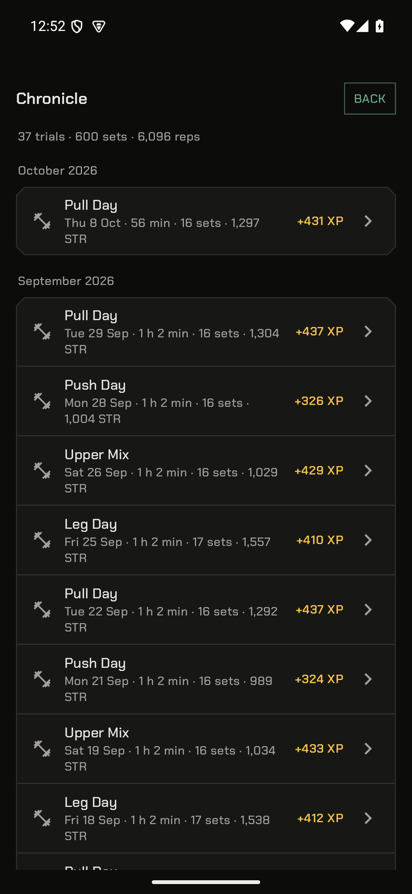

<div align="center">


# Ironvellum

**An offline-first strength training app that scores what you actually lift.**


</div>

---

## What it is

Ironvellum is a training log for Android that keeps its own book of what you
do. You plan a week, perform it set by set, and every finished session is
written down and scored. Nothing needs an account, a signal or a subscription.

Most trackers add up kilograms, which rewards being heavy. Ironvellum scores a
set by what it cost you: your bodyweight is factored in, a marked kilogram is
priced by the machine it was lifted on, and a handstand push-up is not the same
rep as a push-up. The result is a number you can chase without gaming it.

The app speaks in its own words, all defined in
[docs/GLOSSARY.md](docs/GLOSSARY.md). A saved workout is a **rite**. The weekly
plan that places rites on days is a **cycle**. Performing a rite is a
**trial**, and finishing it **seals** it into your **Chronicle**. You are an
Ironbound, and the iron-bound book that keeps the record is the **Ledger**.

<div align="center">

| Today | Train | The trial |
|:---:|:---:|:---:|
|  |  |  |

| Paths | Deeds | Share text |
|:---:|:---:|:---:|
|  |  |  |

| Weekly coverage | The Chronicle | Info sheet |
|:---:|:---:|:---:|
|  |  |  |

</div>

## Features

### Today

- A status page: the rite your cycle puts on today, the level seal, your
  Strength Rank and the way into the Veil. Swipe between days.
- **The Binding**, a guided first run: pick your split, weekly volume, armoury
  (the equipment you own) and goal, then review an editable cycle built from
  the real catalogue. No cycle is imposed on you.
- **The Clean look**: one flat appearance, pop-ups as bottom sheets, and accent
  pairs you can change in settings.

### Training

- **Live trial.** One exercise open at a time and a docked action bar.
  - Type a set's exact load. A load or rep count you change by hand carries to
    the later sets.
  - Rest runs on a timer with -15 s and +15 s buttons, a ready time for each
    movement, a ready buzz and a suggested maximum.
  - Mark sets as warm-ups, or turn on an optional warm-up step before the first
    set.
  - Keep a note per exercise and see it again as *Last time*.
  - Undo a removed set or exercise, and continue a trial you left.
  - Swapped an exercise? The app offers to keep the swap in the rite.
- **After a trial**, tick which changes to sets, reps, load and modifiers go
  back into your cycle. **Amend** a sealed trial later, or delete it from its
  detail page.
- **Progression advice follows the movement.** Each exercise asks for the one
  thing that moves it forward: load; reps, then load; control; mobility; holds;
  or skill. Strength and hypertrophy schools have their own rep bands and
  per-exercise load steps, and a stall deloads instead of repeating a failed
  trial.
- **Weekly coverage.** A body map on the Train tab shows the sets each muscle
  gets in your cycle or the last seven days against the range for your volume
  and goal. Open it for one list with the short muscles first.
- **The Forge** builds a cycle or a single rite from hand-written patterns,
  fitted to your volume and armoury, with the reason for every pick and its
  citation. **Forge a cycle** previews the coverage the cycle would give you
  before you accept it, and **Temper** improves a rite you already have.
- **256 exercises**: barbell, dumbbell, cable, machine, bodyweight, cardio,
  sport, climbing, water and mobility. Each has a swipeable info sheet showing
  the muscles it works, on the live trial screen too.

### Progress

- **Body-scaled scoring.** A rep is worth `reps × (bodyweight + added) /
  bodyweight^0.67`, the allometric exponent. Loads are converted per implement
  (a sled, a smith bar, a pinned stack), movements are weighted by difficulty,
  and strength is normalised by muscle group with per-sex standards.
- **XP, level and Strength Rank** (Untrained to Elite), built from your best
  marks on pull, push and legs.
- **The Ledger** charts body (weight, body fat, BMI, FFMI), training (lift
  records and a calendar) and daily readings. Health Connect reading is
  optional.
- **The Chronicle** lists every sealed trial, month by month.
- **Share a trial** as plain text in the shape of a Wordle grid: a row per
  movement, a square per set, a trophy on a record set, and your load. No link,
  no image. Your per-exercise notes go in only if you opt in; the private note
  never does.
- **The Veil** is an idle layer: each trial leaves an echo, echoes gather
  essence while you are away, and you spend it on relics and crests.

### Codex

- **119 techniques on 14 paths** (pull, push, handstand, lever, planche, rings,
  movement, legs, core, mobility, and squat, bench, press and deadlift
  ladders). Each technique is gated on the one before it and carries a written
  claim standard.
- **105 deeds** with progress you can watch. Each grants a title to wear.

### Allies

Optional, and only with an account.

- Add allies and read their **tidings**.
- Form a **circle** of 2 to 8 allies with a shared weekly goal and a Keeper.
- Stand in **the Reckoning**, a leaderboard for each lift.

### Your data

- Everything is stored on the phone first.
- Export a full JSON archive or a CSV of your trials, and import the archive
  again.
- Import trials from a Strong or Hevy CSV.
- Delete your cloud account from inside the app at any time.

## Install

- **F-Droid:** the listing is still in review with F-Droid, so it is not in
  the store yet. The `foss` build carries no proprietary libraries.
- **Releases:** tagged versions are on
  [GitHub Releases](https://github.com/AlexMollard/Ironvellum/releases).
- **From source:** needs a JDK and the Android SDK.

  ```bash
  git clone https://github.com/AlexMollard/Ironvellum.git
  cd Ironvellum
  ./gradlew :app:assembleFossDebug
  ```

  Two flavours share one application id. `foss` is the F-Droid and GitHub
  build and shows support links. `play` adds Google sign-in and shows none;
  build it with `assemblePlayDebug`. The app needs Android 10 (API 29) or
  newer.

## Privacy and data

Ironvellum works with no account and no network. All training data lives in a
local database, which Android's own backup does not copy.

If you sign in, the app syncs your training record and nothing more: completed
trials and their sets, display name, visibility, earned titles, tributes and
alliances. Body measurements and everything read from Health Connect never
leave the device. You can export or import your data at any time.

The cloud is optional and does not have to be ours. Settings, then Cloud,
accepts any Supabase project of your own, hosted or self-hosted. See
[supabase/SELF_HOSTING.md](supabase/SELF_HOSTING.md).

Full statement: [PRIVACY.md](PRIVACY.md) and
[Play Data Safety answers](docs/PLAY_DATA_SAFETY.md).

## For developers

Kotlin 2.4.20, Jetpack Compose with Material 3, Room 2.8.5, WorkManager,
Health Connect 1.1.0 (read only), and Supabase 3.8.0 over Ktor 3.5.2. AGP
9.4.0, minSdk 29, targetSdk 36. The domain layer is pure Kotlin, which is why
most of it is covered by fast unit tests. Room is the source of truth; the
cloud is a backup, never an authority.

**There is no CI.** The repository is private and every runner minute is
billed, so the workflows are manual (`workflow_dispatch`) only. The gate runs
on your machine:

```bash
python3 tools/gate.py              # build, unit, lint, instrumented
python3 tools/gate.py --backend    # plus the Supabase schema assertions (Docker)
python3 tools/gate.py --no-device  # no emulator: compiles instrumented instead
```

> [!WARNING]
> The instrumented suite calls `pm clear`, deletes rows from the app's own
> database and uninstalls the app. Pointed at a phone with real training on it,
> it destroys that history. `tools/gate.py` pins the run to an emulator and
> refuses a physical device unless you pass `--serial`. If you run Gradle by
> hand, pin it yourself:
> ```bash
> ANDROID_SERIAL=emulator-5554 ./gradlew :app:connectedFossDebugAndroidTest
> ```

`python tools/device.py up` boots the emulator, and `install`, `launch` and
`shot` drive it. Cloud defaults live in `cloud-defaults.properties`;
`local.properties` (gitignored) overrides them and holds the Google sign-in
and release signing keys.

Depth lives in `docs/`:

- [docs/DESIGN.md](docs/DESIGN.md) - the Clean look
- [docs/GLOSSARY.md](docs/GLOSSARY.md) - every word the app shows
- [docs/RELEASE_CHECKLIST.md](docs/RELEASE_CHECKLIST.md) - what ships before a release
- [docs/TODO.md](docs/TODO.md) - outstanding work
- [docs/open-source/](docs/open-source/README.md) - open-sourcing, funding and self-hosting plans
- [COSTS.md](COSTS.md) - what the shared cloud costs
- [AGENTS.md](AGENTS.md) - standing rules for agents working in the repo
- [GOAL.md](GOAL.md) - product direction

## Licence and support

Ironvellum is free software under the
[GNU General Public License v3.0 or later](LICENSE), with no ads, trackers or
paid tier. The artwork is original or generated for this project and shares
that licence; see [docs/ART_ATTRIBUTION.md](docs/ART_ATTRIBUTION.md). The Chakra
Petch font is under the SIL Open Font License 1.1, and the muscle map's body
shapes derive from
[react-native-body-highlighter](https://github.com/HichamELBSI/react-native-body-highlighter)
(MIT). See [NOTICE](NOTICE) and [THIRD_PARTY_NOTICES.md](THIRD_PARTY_NOTICES.md).

Bug reports and pull requests are welcome in
[Issues](https://github.com/AlexMollard/Ironvellum/issues). To help keep the
shared cloud running, support the project through
[GitHub Sponsors](https://github.com/sponsors/AlexMollard) or
[Liberapay](https://liberapay.com/AlexMollard); the `foss` build links to
both.
