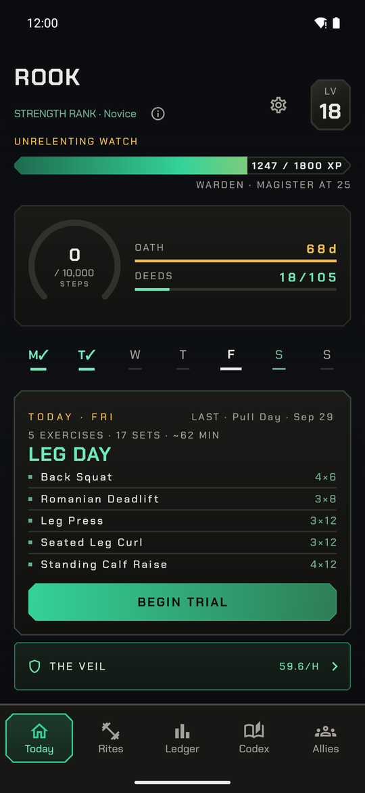
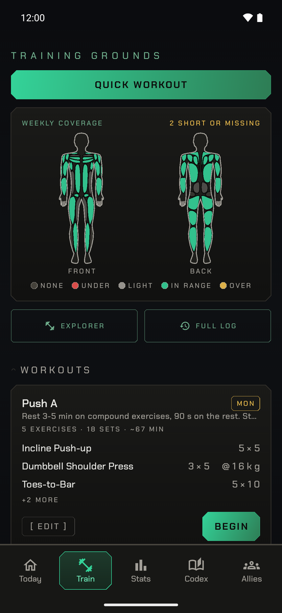
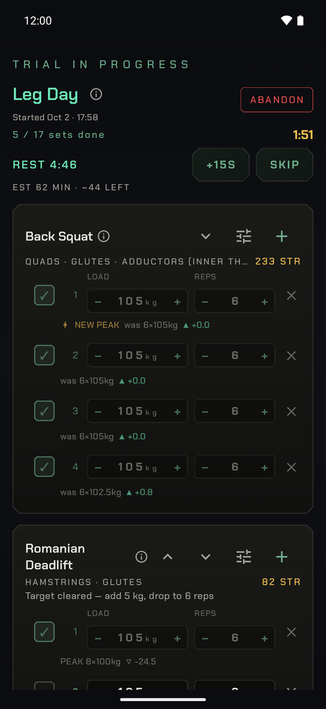
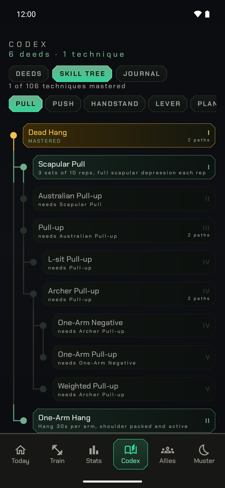
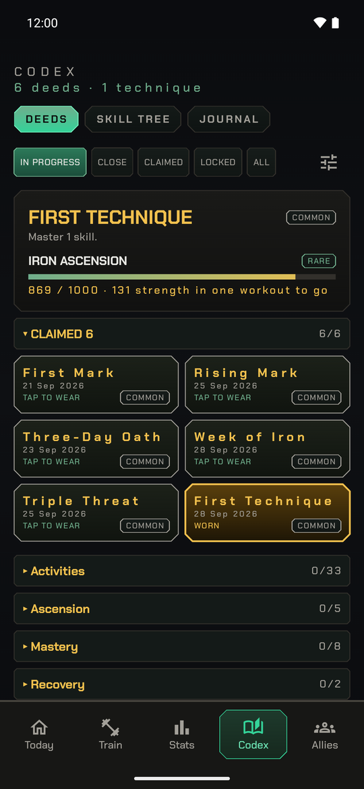
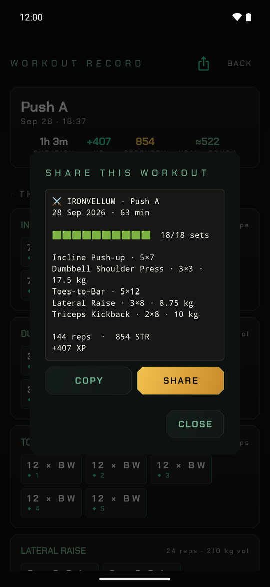
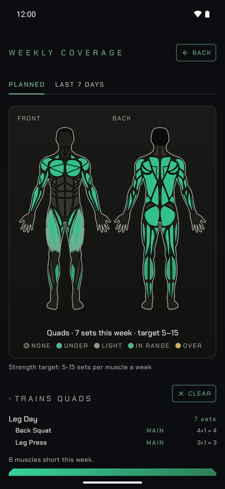
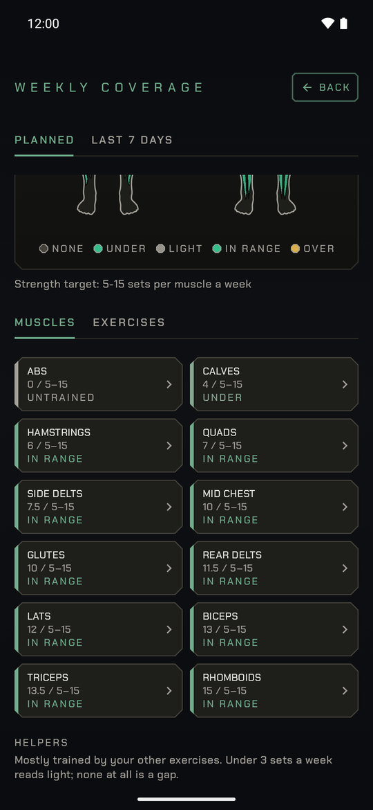
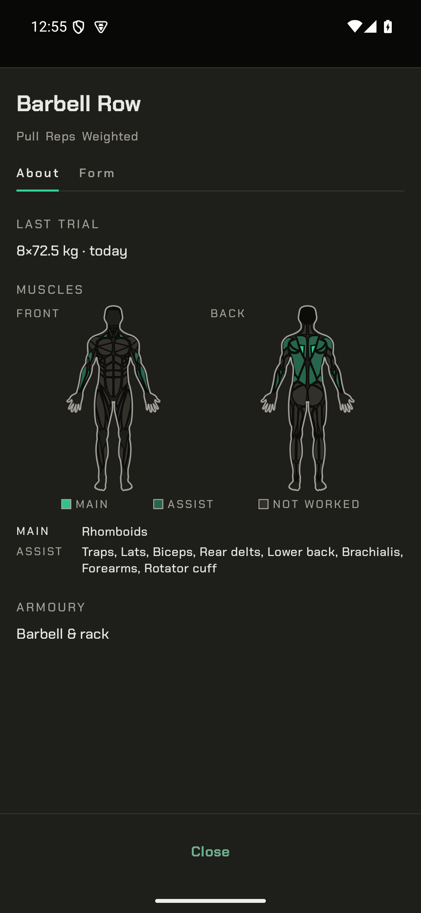
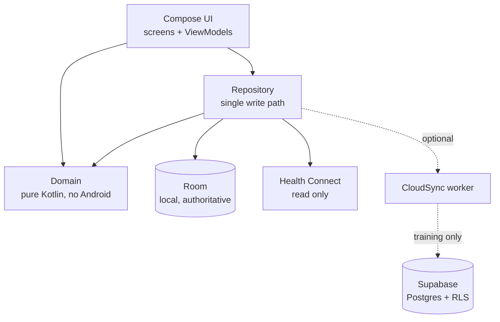

<div align="center">


# Ironvellum

**An Android training tracker that scores what you actually lift.**

Log a workout, get a number that means something. Body-scaled strength scoring,
a 119-technique calisthenics tree, and a first-run flow that builds you a cycle.


</div>

---

<div align="center">

| Your day | The cycle it built you | The trial |
|:---:|:---:|:---:|
|  |  |  |

| Paths | Deeds | Share card |
|:---:|:---:|:---:|
|  |  |  |

| Weekly Coverage | Muscle tiles | Info sheet |
|:---:|:---:|:---:|
|  |  |  |

</div>

## Why this exists

Most trackers add up kilograms. That rewards being heavy and rewards machines
that hide how much load you are really moving, so the number you chase drifts
away from the training that earned it.

Ironvellum scores a set by what it costs you:

- **Body-scaled.** A rep is worth `reps × (bodyweight + added) / bodyweight^0.67`,
  the standard allometric exponent, so a lighter body is not permanently
  outranked for being light.
- **Priced per implement.** A marked kilogram is not the same load on every
  machine. A 45 degree sled transmits `0.70`, a smith bar `0.90`, a pinned stack
  `0.85`, a dual pulley `0.50`. The plate you see is converted to the load you
  actually carry.
- **Difficulty-weighted.** A handstand push-up and a push-up are not the same
  rep. Tiers come from the skill tree the app already ships, so the ordering is
  the one the progression states.
- **Per-sex standards.** Strength score is normalised by muscle group using
  published gaps (Miller et al., sanity-checked against IPF GL), and every
  strength deed states the bar for the person reading it rather than the men's
  number with a footnote.

Everything works offline. An account is optional and only ever backs up
training.

## Features

The app keeps its own words, all defined in [docs/GLOSSARY.md](docs/GLOSSARY.md):
a saved workout is a **rite**, the weekly plan is a **cycle**, a workout in
progress is a **trial**, sealed when you finish and written into your
**chronicle**.

|  | |
|---|---|
| **The Binding** | A guided first run. Pick your split (full body, upper/lower, push/pull/legs), weekly volume, armoury (the equipment you own) and goal, then review an editable cycle built from the real catalogue. No cycle is imposed on you. |
| **The Forge** | An evidence-based builder. Hand-written patterns for each split, for strength or muscle, fitted to your weekly volume (low, standard or high) and your armoury: a full gym, nothing, or toggles for a pull-up bar, dip bars, parallettes, rings, dumbbells, barbell, bench and ab wheel, with dumbbell loads capped at your heaviest and reps raised to match. Or forge a cycle or a single rite sized to the 2020-2026 volume research, or temper a rite you already have and see the before and after. Cap the exercises per rite (5 by default) or turn on Compound & technique only to leave isolation work out. Every exercise says in plain words why it was picked and cites the study. Loads come from your own peaks. |
| **Weekly muscle coverage** | An anatomical body map, male or female to match your profile, on the Rites tab shows the sets each muscle gets in your planned cycle or the last seven days, against the range for your volume and goal. Tap the map to open Weekly Coverage and swipe between MUSCLES, tiles with the gaps first, and EXERCISES, cards you open for the muscles each works. Tap a muscle on any figure to light it with one line of context. The chest counts as upper, mid and lower, and lever and planche holds count toward the muscles they work. Helpers your other exercises mostly train (upper and lower chest, traps, front delts, rotator cuff, serratus, brachialis, forearms, obliques, lower back, hip flexors, adductors, abductors, tibialis) are held to a floor of 3 sets a week instead of a range, and the neck is tracked with no weekly target. Every exercise and technique has a swipeable info sheet that shows its main and assisting muscles on the figure, on the live trial screen too. |
| **Live trials** | Type a set's exact load, watch a running timer, and continue a trial you left instead of starting over. Time estimates learn your pace from the trials you seal. After a trial, tick which changes to sets, reps, load and modifiers go back into your cycle. |
| **256 exercises** | Barbell, dumbbell, cable, plate-loaded, selectorised, smith, assisted, bodyweight, plus cardio, sport, climbing, water and mobility. |
| **Paths: 119 techniques** | Fourteen paths: pull, push, handstand, lever, planche, rings, movement, legs, core, mobility, plus squat, bench, press and deadlift ladders with bodyweight-relative bars. Pick a path from the grid and follow its game-style nodes. Each technique is gated on the one before it and carries a written claim standard. |
| **105 deeds** | Level, volume, oath (days kept in a row), strength and activity milestones, with progress you can watch rather than a surprise. Each deed grants a title to wear. |
| **Progressive overload** | Strength and hypertrophy schools with their own rep bands, per-exercise load steps and a stall rule that deloads instead of repeating a failed trial. |
| **The Ledger** | Scrubbable charts over BODY (weight, body fat, BMI, FFMI), TRAINING (lift records and a calendar) and DAILY tabs; optional Health Connect read of weight, body fat, resting heart rate, steps, distance, energy and sleep, with past history and a background refresh. |
| **Shareable trials** | A plain text card shaped after Wordle, no link and no image, that states only what you did. |
| **The Veil** | An idle layer: each trial leaves an echo, and echoes gather essence while you are away, spent on inscriptions for relics and crests. |
| **Optional cloud** | Sign in to back up training, follow your allies' tidings, form a circle with a shared weekly goal and a Keeper, and stand in the Reckoning, a leaderboard for each lift. Body measurements and health data never leave the device. Delete your cloud account from the app at any time. |

## Architecture


```mermaid
flowchart TD
    UI["Compose UI<br/>screens + ViewModels"] --> REPO["Repository<br/>single write path"]
    UI --> DOM["Domain<br/>pure Kotlin, no Android"]
    REPO --> DOM
    REPO --> ROOM[("Room<br/>local, authoritative")]
    REPO --> HC["Health Connect<br/>read only"]
    REPO -. optional .-> SYNC["CloudSync worker"]
    SYNC -. training only .-> SB[("Supabase<br/>Postgres + RLS")]
```

The domain layer holds the scoring, progression, titles and skill rules as pure
Kotlin, which is why most of it is covered by fast unit tests. Room is the
source of truth: the cloud is a backup, never an authority.

## Tech stack

| Layer | Choice |
|---|---|
| Language | Kotlin 2.4.20 |
| UI | Jetpack Compose, Material 3, an optional hand-drawn "ink" theme |
| Local data | Room 2.8.5 with versioned migrations and migration tests |
| Background | WorkManager |
| Health | Health Connect 1.1.0 (read only, optional) |
| Cloud | Supabase 3.8.0 over Ktor 3.5.2, row level security, optional |
| Build | AGP 9.4.0, Gradle version catalog, R8 + resource shrinking on release |
| Min / target | Android 10 (API 29) / API 36 |

## Getting started

```bash
git clone https://github.com/AlexMollard/Ironvellum.git
cd Ironvellum
./gradlew :app:assembleFossDebug
```

The app runs with no backend. The cloud defaults are committed in
`cloud-defaults.properties` (public URL + publishable key — row-level security
is what protects the data); `local.properties` overrides them. Google sign-in
keys are read from `local.properties` only and only reach the `play` flavour.
Build `assemblePlayDebug` for the Google sign-in variant.

Prefer not to use the shared cloud at all? Settings → CLOUD accepts any
Supabase project of your own — hosted free tier or self-hosted with Docker.
See [supabase/SELF_HOSTING.md](supabase/SELF_HOSTING.md).

```properties
# local.properties, gitignored
supabase.url=
supabase.key=
google.webClientId=

# only needed for a signed release build (env vars of the same name also work)
ironvellum.keystore.path=
ironvellum.keystore.password=
ironvellum.key.alias=
ironvellum.key.password=
```

### Without a phone attached

Everything runs on a headless emulator, so no cable is needed:

```bash
python tools/device.py up        # boots the IronvellumEmu AVD if nothing is attached
python tools/device.py install
python tools/device.py launch
python tools/device.py shot home # .tmp/shots/home.png
python tools/device.py labels    # visible text, for finding a tap target
```

> [!NOTE]
> The emulator renders on the host GPU (`-gpu host`). Its screenshots are still not
> pixel-comparable with a real device: the GL translation differs and the ink seeds
> resolve per pixel size, so only compare shots taken on the same target.

> [!WARNING]
> The instrumented suite calls `pm clear` and writes to the app's own database.
> With a personal phone attached, pin the run to the emulator or it will destroy
> real training history:
> ```bash
> ANDROID_SERIAL=emulator-5554 ./gradlew :app:connectedFossDebugAndroidTest
> ```

## Testing

| Command | What it is there to catch |
|---|---|
| `:app:testFossDebugUnitTest` | Scoring maths, progression, titles, catalogue invariants, the cloud wire format, crash journal, migration registry |
| `:app:connectedFossDebugAndroidTest` | Room migrations against real SQLite, data survival across upgrades, navigation reachability, accessibility floors, and the user journeys (workout loop, skill practice, workout auto-fill, first run, delete) |
| `:app:lintFossRelease` | Release-variant lint; triage the SARIF report, not the HTML |
| `supabase/test/assert_all.sql` | What no Kotlin test can see: which tables have row security, who may execute which function, which columns a lifter may write, whether a feed row can pin itself, what sign-up does with a name |

The backend assertions need Docker rather than a device:

```bash
docker run -d --rm --name pg -e POSTGRES_PASSWORD=probe -p 5432:5432 postgres:16
psql -h localhost -U postgres -f supabase/test/supabase_stub.sql
psql -h localhost -U postgres -v ON_ERROR_STOP=1 -f supabase/migrations/0001_baseline.sql
psql -h localhost -U postgres -v ON_ERROR_STOP=1 -f supabase/test/assert_all.sql
```

`python tools/gate.py --backend` does all of that and also proves the hosted
reset: it seeds data, runs `supabase/reset.sql`, checks nothing was left
behind, re-applies the baseline and asserts again.

<details>
<summary><b>Project layout</b></summary>

```
app/src/main/kotlin/com/ironvellum/app/
  domain/      pure Kotlin: scoring, progression, titles, skills, share text
  data/        Room database, DAOs, Repository, seed catalogue, cloud sync
  ui/          Compose screens by feature, plus theme and shared components
app/src/test/          unit tests over the domain and wire format
app/src/androidTest/   instrumented: migrations, journeys, accessibility
supabase/migrations/   the whole schema and row level security, one baseline file
supabase/reset.sql     wipes the hosted debug project before the baseline is applied
supabase/test/         SQL assertions the Kotlin tests cannot make
tools/                 device driving, art generation, geometry sweeps
docs/                  release checklist, data safety, TODO, attribution
```

</details>

## Privacy

Signing in and syncing uploads the training record only: completed workouts and
their sets, display name, visibility, earned titles, likes, friendships and the
muster aggregates. Body measurements and everything read from Health Connect
stay on the device, and the app is fully usable without an account.

Full statement: [PRIVACY.md](PRIVACY.md) ·
[Play Data Safety answers](docs/PLAY_DATA_SAFETY.md)

## Contributing

Issues and pull requests are welcome. There is no automatic CI: run the gate on
your own machine before opening a pull request.

```bash
python3 tools/gate.py              # build, unit, lint, instrumented (emulator)
python3 tools/gate.py --backend    # plus the Supabase schema assertions (Docker)
```

Point instrumented runs at an emulator, never a phone with real training on it.

## Licence

Ironvellum is free software under the
[GNU General Public License v3.0 or later](LICENSE). The artwork is original
or generated for this project and shares that licence; the Chakra Petch font is
under the SIL Open Font License 1.1. The muscle map's body shapes and outlines are
derived from [react-native-body-highlighter](https://github.com/HichamELBSI/react-native-body-highlighter)
(MIT). See [NOTICE](NOTICE) and [THIRD_PARTY_NOTICES.md](THIRD_PARTY_NOTICES.md).

## Docs

- [GOAL.md](GOAL.md) - product direction
- [docs/RELEASE_CHECKLIST.md](docs/RELEASE_CHECKLIST.md) - what ships before a release
- [docs/TODO.md](docs/TODO.md) - outstanding work and open decisions
- [docs/ART_ATTRIBUTION.md](docs/ART_ATTRIBUTION.md) - how the artwork was made
- [docs/open-source/](docs/open-source/README.md) - plan for open-sourcing, funding and self-hosting
